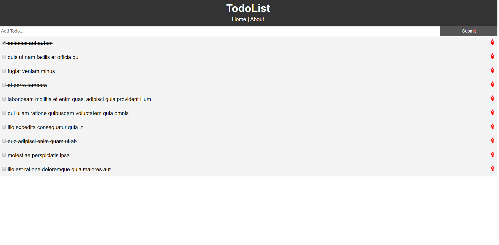
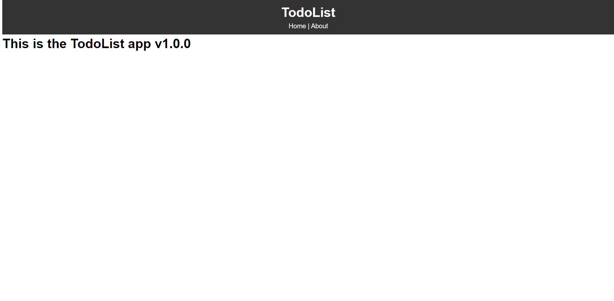

A simple todo app made with React to get you started(NO Redux used just setState).
 
 

## 💻 Requirements
* Any Operating System (ie. MacOS X, Linux, Windows)
* A little knowledge of ReactJs

## ✨ Features
- [x] View Todos.
- [x] Cross out Todos.

## 📸 ScreenShots

|||

## 🤓 Author(s)
**Okocha Ebube**

## 🔖 LICENCE
[Apache-2.0] 